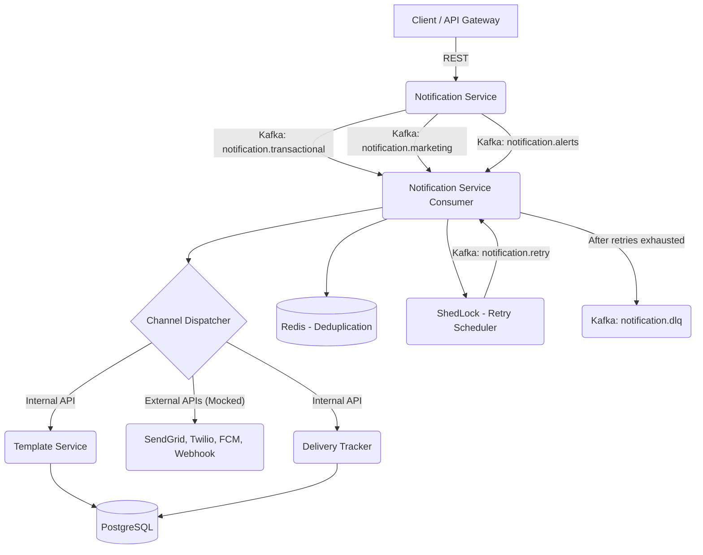
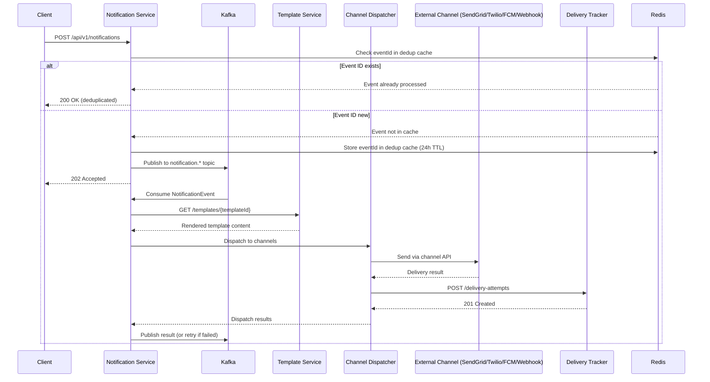
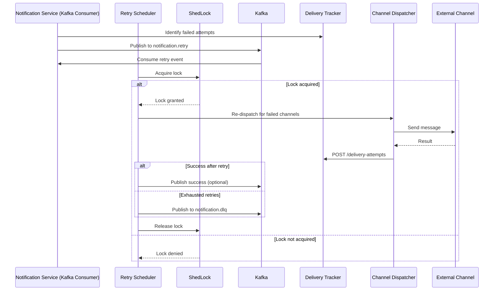
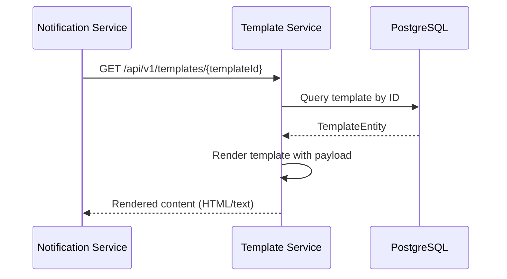
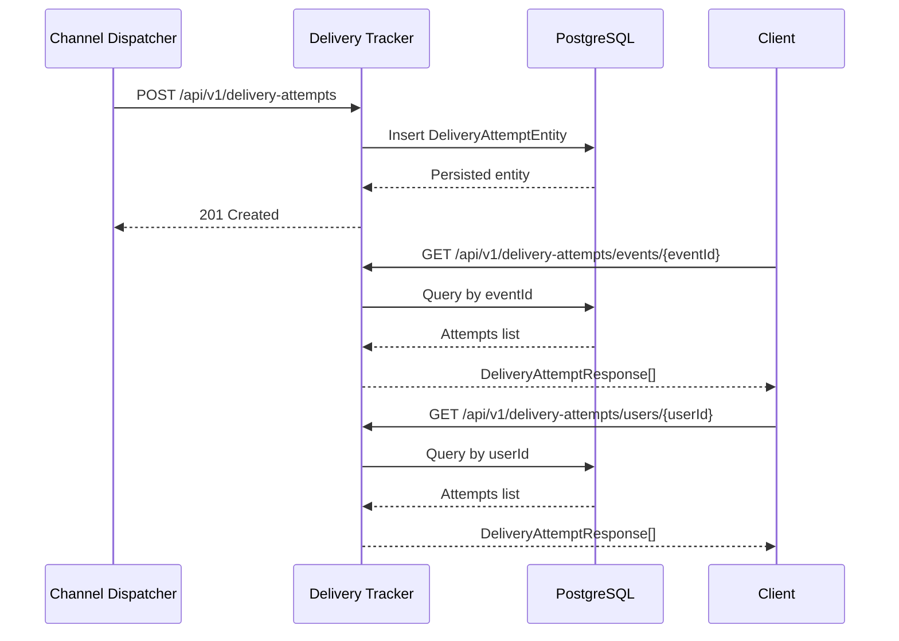

# Notification Platform

[](https://adoptium.net/)
[](https://spring.io/projects/spring-boot)
[](https://kafka.apache.org/)
[](https://www.postgresql.org/)
[](https://redis.io/)
[](https://maven.apache.org/)
[](https://www.docker.com/)
[](LICENSE)
[](https://github.com/abhim8/notification-platform/actions/workflows/build.yml)
[](https://github.com/abhim8/notification-platform)
[](https://github.com/abhim8/notification-platform/issues)

> Production-grade, event-driven notification platform for reliable multi-channel communication.
> Built with Java 23, Spring Boot 3.x, Apache Kafka, PostgreSQL, and Redis.

---

**Navigation:** [Services](#services) · [Architecture](#high-level-architecture) · [Event Flow](#event-flow) · [Tech Stack](#technology-stack) · [Project Structure](#project-structure) · [Configuration](#configuration) · [Running Locally](#running-locally) · [Docker](#docker--docker-compose) · [Kafka Topics](#kafka-topics) · [APIs](#rest-apis) · [Postman](#postman-collection) · [Build & CI](#build--ci) · [Contributing](CONTRIBUTING.md) · [Security](SECURITY.md) · [Startup Guide](STARTUP_GUIDE.md)

---

## Project Overview

The Notification Platform is an event-driven microservice system that enables reliable, scalable, and auditable delivery of notifications across multiple channels - email, SMS, push notifications, and webhooks. It decouples notification production from delivery through asynchronous event streaming, ensuring resilience under load and providing built-in retry with idempotency guarantees.

### Responsibilities

- **Ingest** notification requests via REST API or Kafka events
- **De-duplicate** incoming events within a configurable time window via Redis
- **Resolve & render** notification templates via a dedicated template service
- **Dispatch** through channel-specific adapters (email, SMS, push, webhook)
- **Track & audit** every delivery attempt with full history
- **Retry** failed deliveries with exponential backoff and distributed scheduling
- **Dead-letter** events that exhaust all retry attempts for manual inspection

### Key Features

| Feature | Description |
|---------|-------------|
| Multi-channel | Email (SendGrid), SMS (Twilio), Push (FCM), Webhook |
| Event-Driven | Kafka-based async processing with topic segregation |
| Idempotency | Redis-backed deduplication with configurable TTL (default 24h) |
| Template Management | Centralized template storage, versioning, and dynamic rendering |
| Delivery Tracking | Full audit trail of every delivery attempt across all channels |
| Retry Scheduler | Distributed retry via ShedLock with exponential backoff (1s, 5s, 30s) |
| Dead Letter Queue | Exhausted events published to `notification.dlq` for monitoring |
| Distributed Tracing | MDC-based `traceId` propagation across service boundaries |
| Structured Logging | JSON-format logs with Log4j2 for centralized log aggregation |
| Hexagonal Architecture | Clean separation of domain, application, adapter, and infrastructure layers |

### Services

| Service | Port | Description |
|---------|------|-------------|
| **notification-service** | 8001 | Core orchestration - Kafka consumer, channel dispatcher, deduplication, retry logic |
| **template-service** | 8002 | Template management, storage, and dynamic rendering |
| **delivery-tracker** | 8003 | Delivery attempt recording, history queries, and audit trail |
| **notification-platform-common** | - | Shared domain enums, exceptions, DTOs, and auto-configuration |

---

## High-Level Architecture



## Event Flow



### Retry Flow



### Template Resolution Flow



### Delivery Tracking Flow



---

## Technology Stack

| Category | Technology | Version | Purpose |
|----------|-----------|---------|---------|
| Language | Java | 23 | Runtime & compilation |
| Framework | Spring Boot | 3.3.0 | Application framework |
| Cloud | Spring Cloud | 2023.0.0 | Cloud-native patterns |
| Event Streaming | Apache Kafka (Confluent) | 7.5.0 | Async event processing |
| Database | PostgreSQL | 16 | Persistent storage |
| Cache / Dedup | Redis | 7.2 | Idempotency cache |
| Migrations | Liquibase | 4.31.1 | Schema management |
| Distributed Locking | ShedLock | 5.9.1 | Retry scheduler coordination |
| API Docs | Springdoc OpenAPI | 2.1.0 | Swagger UI |
| Logging | Log4j2 + JSON Template | 2.23.1 | Structured logging |
| Build | Maven | 3.8+ | Build & dependency management |
| CI | GitHub Actions | - | Automated build & test |
| Containerization | Docker / Docker Compose | - | Local dev & deployment |

### Channel Adapters (Mocked)

| Channel | Library | Adapter |
|---------|---------|---------|
| Email | SendGrid SDK 4.10.2 | `SendGridAdapter` |
| SMS | Twilio SDK 9.2.0 | `TwilioAdapter` |
| Push | Firebase Admin SDK 9.2.0 | `FcmAdapter` |
| Webhook | Spring WebClient | `WebhookAdapter` |

---

## Project Structure

```
notification-platform/
├── notification-platform-common/         # Shared domain, exceptions, DTOs, auto-config
│   ├── domain/                           # Channel, EventType, DeliveryStatus enums
│   ├── dto/                              # ErrorResponse, ValidationError
│   ├── exception/                        # BaseApiException hierarchy
│   ├── handler/                          # GlobalExceptionHandler
│   └── config/                           # CommonAutoConfiguration, MdcFilter
│
├── notification-service/                 # Core orchestration service (port 8001)
│   ├── domain/
│   │   ├── channel/                      # ChannelDispatcher, DispatchResult
│   │   ├── event/                        # NotificationEvent
│   │   └── model/                        # NotificationStatus, RetryPolicy
│   ├── application/
│   │   ├── service/                      # DeduplicationService, TemplateResolver
│   │   └── usecase/                      # SendNotificationUseCase, RetryUseCase
│   ├── adapter/
│   │   ├── channels/                     # SendGrid, Twilio, FCM, Webhook adapters
│   │   ├── kafka/                        # Kafka consumer/producer
│   │   └── rest/                         # REST controller, DTOs
│   └── infrastructure/
│       ├── redis/                        # RedisDeduplicationService
│       ├── shedlock/                     # RetryScheduler, ShedLockConfig
│       ├── client/                       # TemplateServiceClient, DeliveryTrackerClient
│       └── template/                     # MockTemplateResolver
│
├── template-service/                     # Template management (port 8002)
│   ├── domain/                           # Template, TemplateRepository
│   ├── application/                      # TemplateUseCase
│   └── adapter/
│       ├── postgres/                     # JPA entity, repository, persistence adapter
│       └── rest/                         # REST controller, DTOs
│
├── delivery-tracker/                     # Delivery attempt tracking (port 8003)
│   ├── application/                      # CreateAttemptCommand, DeliveryAttemptUseCase
│   └── adapter/
│       ├── postgres/                     # JPA entity, repository
│       └── rest/                         # REST controller, DTOs
│
├── docs/
│   └── postman/                          # Postman collection & environment
├── docker-compose.yml                    # Kafka, Zookeeper, Kafka UI
├── pom.xml                               # Multi-module Maven parent POM
└── .github/workflows/build.yml           # CI pipeline
```

---

## Configuration

### Environment Variables

All services support environment variable overrides. Below are the key variables grouped by service.

<details>
<summary><b>Notification Service</b></summary>

| Variable | Default | Description |
|----------|---------|-------------|
| `SERVER_PORT` | `8001` | HTTP server port |
| `KAFKA_BOOTSTRAP_SERVERS` | `localhost:9092` | Kafka broker address |
| `DB_HOST` | `jdbc:postgresql://localhost:5432/notification?currentSchema=notification_schema` | PostgreSQL JDBC URL |
| `DB_USER` | `notif_user` | Database username |
| `DB_PASSWORD` | (empty) | Database password |
| `REDIS_HOST` | `localhost` | Redis host |
| `REDIS_PORT` | `6379` | Redis port |
| `RETRY_SCHEDULER_INTERVAL_MS` | `60000` | Retry scheduler frequency |
| `RETRY_SCHEDULER_INITIAL_DELAY_MS` | `30000` | Initial delay before first retry run |
| `TEMPLATE_SERVICE_URL` | `http://localhost:8002` | Template service base URL |
| `DELIVERY_TRACKER_URL` | `http://localhost:8003` | Delivery tracker base URL |
| `SENDGRID_API_KEY` | `mock-key` | SendGrid API key |
| `SENDGRID_FROM_EMAIL` | `noreply@notification-platform.com` | Sender email address |
| `TWILIO_ACCOUNT_SID` | `mock-sid` | Twilio account SID |
| `TWILIO_AUTH_TOKEN` | `mock-token` | Twilio auth token |
| `TWILIO_FROM_NUMBER` | `+1234567890` | Twilio sender number |
| `FIREBASE_ENABLED` | `false` | Enable Firebase push |
| `FIREBASE_PROJECT_ID` | `mock-project` | Firebase project ID |
| `WEBHOOK_TIMEOUT_MS` | `5000` | Webhook call timeout |
| `WEBHOOK_MAX_RETRIES` | `1` | Webhook max retry attempts |
| `IDEMPOTENCY_TTL_HOURS` | `24` | Deduplication cache TTL |
</details>

<details>
<summary><b>Template Service</b></summary>

| Variable | Default | Description |
|----------|---------|-------------|
| `TEMPLATE_SERVICE_PORT` | `8002` | HTTP server port |
| `DB_HOST` | `jdbc:postgresql://localhost:5432/notification?currentSchema=notification_schema` | PostgreSQL JDBC URL |
| `DB_USER` | `notif_user` | Database username |
| `DB_PASSWORD` | (empty) | Database password |
</details>

<details>
<summary><b>Delivery Tracker</b></summary>

| Variable | Default | Description |
|----------|---------|-------------|
| `DELIVERY_TRACKER_PORT` | `8003` | HTTP server port |
| `DB_HOST` | `jdbc:postgresql://localhost:5432/notification?currentSchema=notification_schema` | PostgreSQL JDBC URL |
| `DB_USER` | `notif_user` | Database username |
| `DB_PASSWORD` | (empty) | Database password |
</details>

---

## Running Locally

### Prerequisites

- **Java 23** (or later) - [Temurin](https://adoptium.net/) recommended
- **Maven 3.8+**
- **Docker & Docker Compose** - for Kafka, Zookeeper, Kafka UI
- **PostgreSQL 16** - running locally on port 5432
- **Redis 7.2** - running locally on port 6379

### 1. Start Infrastructure Services

```bash
# Start PostgreSQL (macOS with Homebrew)
brew services start postgresql

# Start Redis
brew services start redis

# Verify connections
psql -U notif_user -d notification
redis-cli ping   # Should return PONG
```

### 2. Start Kafka & Zookeeper

```bash
docker-compose up -d

# Verify Kafka is running
docker-compose logs kafka-init
# Should see: "All topics created successfully!"
```

### 3. Initialize Database Schema

```sql
CREATE SCHEMA IF NOT EXISTS notification_schema;
```

Liquibase will automatically run migrations on service startup.

### 4. Build the Application

```bash
mvn clean compile          # Compile all modules
mvn test                   # Run tests
mvn package -DskipTests    # Build JARs
```

### 5. Start Services

Each service runs in its own terminal:

```bash
# Terminal 1 - Notification Service (port 8001)
mvn spring-boot:run -pl notification-service

# Terminal 2 - Template Service (port 8002)
mvn spring-boot:run -pl template-service

# Terminal 3 - Delivery Tracker (port 8003)
mvn spring-boot:run -pl delivery-tracker
```

### Verify

```bash
# Health check
curl http://localhost:8001/actuator/health
curl http://localhost:8002/actuator/health
curl http://localhost:8003/actuator/health

# Swagger UIs
open http://localhost:8001/swagger-ui.html
open http://localhost:8002/swagger-ui.html
open http://localhost:8003/swagger-ui.html
```

---

## Docker / Docker Compose

The `docker-compose.yml` at the project root provides the required event-streaming infrastructure:

| Service | Image | Ports | Purpose |
|---------|-------|-------|---------|
| `zookeeper` | confluentinc/cp-zookeeper:7.5.0 | 2181 | Kafka coordinator |
| `kafka` | confluentinc/cp-kafka:7.5.0 | 9092 (internal), 29092 (external) | Message broker |
| `kafka-init` | confluentinc/cp-kafka:7.5.0 | - | Topic initialization |
| `kafka-ui` | provectuslabs/kafka-ui:latest | 8080 | Web UI for Kafka |

Topics created automatically on startup (retention: 24 hours):

| Topic | Partitions |
|-------|-----------|
| `notification.transactional` | 1 |
| `notification.marketing` | 1 |
| `notification.alerts` | 1 |
| `notification.retry` | 1 |
| `notification.dlq` | 1 |

```bash
# Start Kafka infrastructure
docker-compose up -d

# View Kafka UI
open http://localhost:8080

# Stop everything
docker-compose down
```

---

## Service Communication

| From | To | Protocol | Purpose |
|------|----|----------|---------|
| Client | Notification Service | REST / Kafka | Submit notification requests |
| Notification Service | Template Service | REST (HTTP) | Resolve & render templates |
| Notification Service | Delivery Tracker | REST (HTTP) | Record & query delivery attempts |
| Notification Service | External Channels | REST (HTTP) | Dispatch email, SMS, push, webhook |
| Notification Service | Kafka | Async | Publish/consume events |
| Notification Service | Redis | TCP | Idempotency cache |
| Retry Scheduler | PostgreSQL (ShedLock) | JDBC | Distributed lock coordination |

---

## Kafka Topics

| Topic | Consumer Group | Produced By | Consumed By | Purpose |
|-------|---------------|-------------|-------------|---------|
| `notification.transactional` | `notif-svc-trans` | Notification Service | Notification Service | High-priority transactional notifications |
| `notification.marketing` | `notif-svc-mktg` | Notification Service | Notification Service | Marketing notifications |
| `notification.alerts` | `notif-svc-alerts` | Notification Service | Notification Service | Urgent alerts & critical notifications |
| `notification.retry` | `notif-svc-retry` | Notification Service | Notification Service | Failed events awaiting retry |
| `notification.dlq` | (monitoring) | Notification Service | - | Events that exhausted all retries |

### Monitor Kafka

```bash
# List topics
docker-compose exec kafka kafka-topics --list --bootstrap-server kafka:29092

# Consume messages
docker-compose exec kafka kafka-console-consumer \
  --bootstrap-server kafka:29092 \
  --topic notification.transactional \
  --from-beginning

# Describe topic
docker-compose exec kafka kafka-topics --describe \
  --bootstrap-server kafka:29092 \
  --topic notification.transactional
```

---

## REST APIs

### Notification Service (port 8001)

| Method | Path | Description |
|--------|------|-------------|
| POST | `/api/v1/notifications` | Submit a new notification |
| GET | `/api/v1/notifications/{eventId}` | Get delivery status for an event |
| GET | `/api/v1/notifications/{eventId}/attempts` | Redirect to delivery tracker for event attempts |

### Template Service (port 8002)

| Method | Path | Description |
|--------|------|-------------|
| GET | `/api/v1/templates` | List all templates |
| GET | `/api/v1/templates/{templateId}` | Get template by ID |
| POST | `/api/v1/templates/{templateId}/render` | Render template with payload |
| HEAD | `/api/v1/templates/{templateId}` | Check if template exists |

### Delivery Tracker (port 8003)

| Method | Path | Description |
|--------|------|-------------|
| POST | `/api/v1/delivery-attempts` | Record a delivery attempt |
| GET | `/api/v1/delivery-attempts/{attemptId}` | Get attempt by ID |
| GET | `/api/v1/delivery-attempts/events/{eventId}` | Get attempts for an event |
| GET | `/api/v1/delivery-attempts/events/{eventId}/channels/{channel}` | Get attempts for event + channel |
| GET | `/api/v1/delivery-attempts/users/{userId}` | Get attempts for a user |
| GET | `/api/v1/delivery-attempts/failed` | Get failed attempts (for retry) |

### Swagger UIs

- Notification Service: `http://localhost:8001/swagger-ui.html`
- Template Service: `http://localhost:8002/swagger-ui.html`
- Delivery Tracker: `http://localhost:8003/swagger-ui.html`

---

## Postman Collection

A Postman collection with pre-configured requests for all services is available:

- **Collection:** [`docs/postman/postman_collection.json`](docs/postman/postman_collection.json)
- **Environment:** [`docs/postman/local.postman_environment.json`](docs/postman/local.postman_environment.json)

### Import Instructions

1. Open Postman
2. **File → Import** → Select both files
3. Select the `local` environment from the environment dropdown
4. Start sending requests!

The collection includes:

| Folder | Requests |
|--------|----------|
| `notification-service` | Send notification, get delivery status, get attempts link |
| `template-service` | List templates, get template, render template, check template |
| `delivery-tracker` | Record attempt, get by ID, get by event, get by user, get failed |

---

## Build & CI

### Maven Modules

```bash
# Compile all modules
mvn clean compile

# Run all tests
mvn test

# Run tests for a specific module
mvn clean test -pl notification-service

# Build JARs
mvn package -DskipTests

# Full verify (includes tests)
mvn clean verify
```

### CI Pipeline (GitHub Actions)

The repository uses a GitHub Actions workflow (`.github/workflows/build.yml`) that runs on every push/PR to `main`:

- **JDK:** Temurin 23
- **Command:** `mvn clean verify`
- **Trigger:** Push or pull request to `main`

### Code Quality

- **Hexagonal architecture:** domain → application → adapter → infrastructure
- **Conventional commits:** `feat:`, `fix:`, `chore:`, `docs:`, `refactor:`, `test:`
- **Branch naming:** `feat/`, `fix/`, `chore/`, `docs/` prefixes
- **Lombok** for boilerplate reduction
- **@Slf4j** for logging (no `System.out`)

---

## Deployment

### Current Setup

The platform is designed for local development and testing. Microservices run as standalone Spring Boot applications communicating via Kafka and REST. Infrastructure dependencies (Kafka, PostgreSQL, Redis) are managed outside the application containers.

### Recommended Production Enhancements

- **Containerize** each service with Docker and deploy to Kubernetes
- **Managed Kafka** (Confluent Cloud, MSK, or Event Hubs)
- **Managed PostgreSQL** (RDS, Cloud SQL, or Azure Database)
- **Managed Redis** (ElastiCache, Redis Cloud, or Azure Cache for Redis)
- **API Gateway** for unified entry point, authentication, rate limiting
- **Service Mesh** (Istio/Linkerd) for observability, traffic management
- **Distributed Tracing** (Jaeger/Zipkin) with OpenTelemetry
- **Metrics & Monitoring** with Prometheus + Grafana
- **Circuit Breaker** (Resilience4j) for resilience
- **Secret Management** (HashiCorp Vault, AWS Secrets Manager)

---

## Future Enhancements

- **Real channel implementations** - Replace mock adapters with production SendGrid/Twilio/Firebase credentials
- **Event store** - Track overall notification lifecycle status beyond individual delivery attempts
- **Delivery dashboard** - Visualize delivery metrics, success rates, and latency
- **Alerting** - Configure alerts for high failure rates or DLQ accumulation
- **Multi-tenant support** - Isolate notifications by tenant
- **Rate limiting** - Per-channel and per-user rate limiting
- **Batch dispatch** - Aggregate multiple notifications into a single channel call
- **Webhook signature verification** - HMAC signing for outgoing webhooks
- **Audit logging** - Full compliance audit trail for all notification operations

---

## Documentation

| Document | Description |
|----------|-------------|
| [**STARTUP_GUIDE.md**](STARTUP_GUIDE.md) | End-to-end local setup with examples and troubleshooting |
| [**CONTRIBUTING.md**](CONTRIBUTING.md) | Contribution guidelines, branch naming, commit conventions |
| [**SECURITY.md**](SECURITY.md) | Security policy and vulnerability reporting |
| [**notification-service/README.md**](notification-service/README.md) | Notification Service - architecture, APIs, Kafka topics, Redis, retry |
| [**template-service/README.md**](template-service/README.md) | Template Service - APIs, database, rendering flow |
| [**delivery-tracker/README.md**](delivery-tracker/README.md) | Delivery Tracker - APIs, database, statuses, integration |
| [**notification-platform-common/README.md**](notification-platform-common/README.md) | Common module - enums, exceptions, DTOs, auto-configuration |
| [**Postman Collection**](docs/postman/postman_collection.json) | Pre-configured API requests for all services |

---

## License

This project is licensed under the MIT License - see the [LICENSE](LICENSE) file for details.
