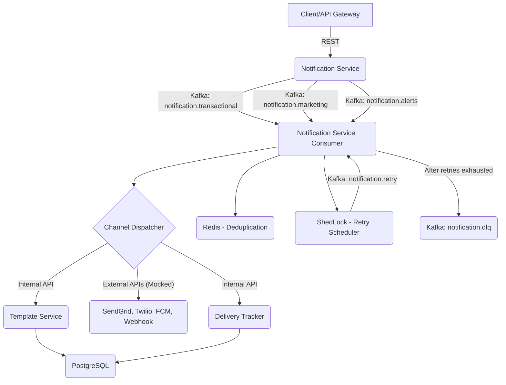
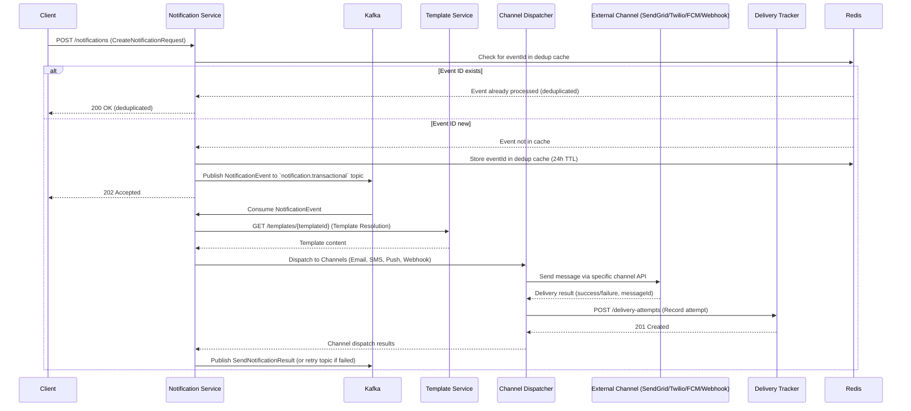
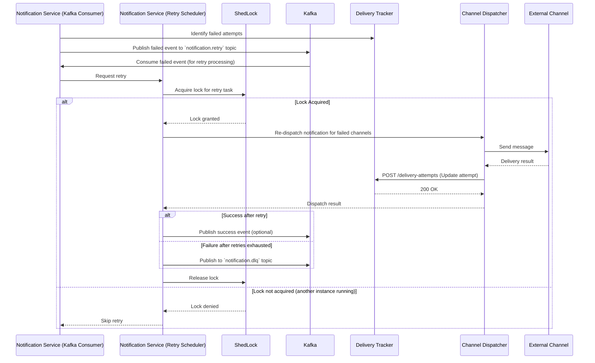
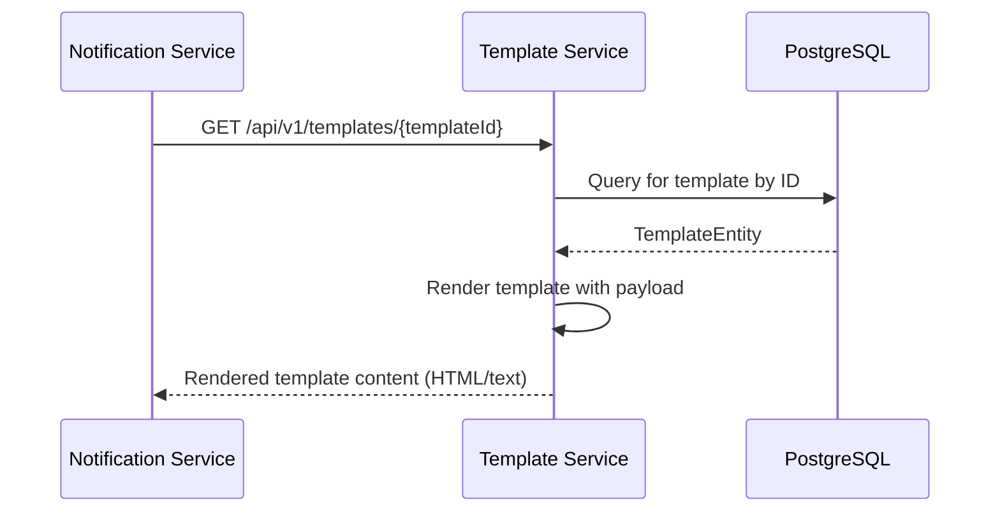
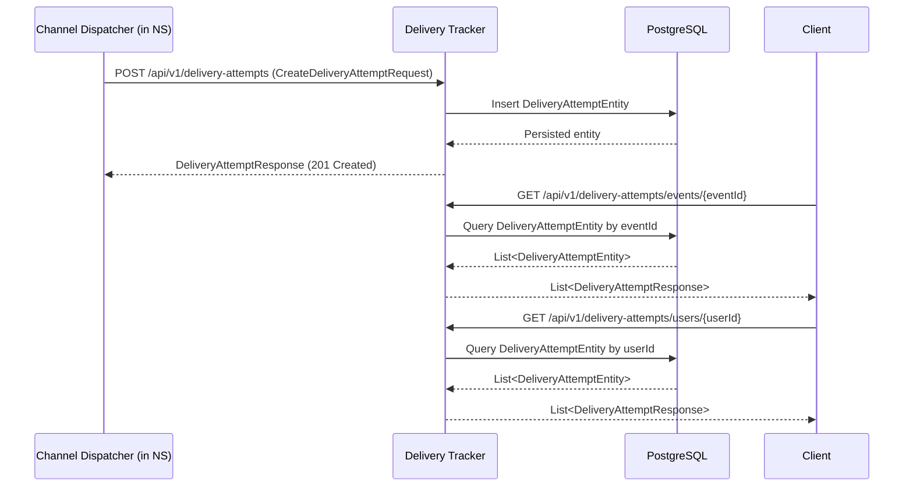

# Notification Platform

## Project Overview

This is a production-grade, event-driven notification platform designed for reliable and scalable communication across various channels. It's built with modern Java and Spring Boot practices, emphasizing clear architectural boundaries and robust handling of notifications.

### Key Features
*   **Multi-channel Notifications:** Supports email, SMS, push notifications, and webhooks.
*   **Event-Driven Architecture:** Utilizes Apache Kafka for asynchronous message processing.
*   **Template Management:** Centralized service for managing and rendering notification templates.
*   **Delivery Tracking:** Comprehensive tracking of all notification delivery attempts.
*   **Idempotency & Retry Mechanisms:** Ensures reliable delivery with deduplication and configurable retry policies.
*   **Observability:** Integrated logging with MDC for tracing requests across services.

## High-Level Architecture

The platform consists of several interconnected microservices, each with distinct responsibilities, communicating primarily via Kafka for asynchronous operations and REST APIs for synchronous interactions.



## Module Structure

The project is structured into a multi-module Maven build, ensuring clear separation of concerns:

*   **`notification-platform`**: The root project, aggregating all modules.
*   **`notification-platform-common`**: Shared utilities, domain enums, exceptions, and auto-configurations.
*   **`notification-service`**: Core service for consuming events, dispatching to channels, managing idempotency, and retry logic.
*   **`template-service`**: Manages notification templates and renders them with provided data.
*   **`delivery-tracker`**: Records and provides history for all notification delivery attempts.

## Purpose of Each Service

*   **Notification Service (Port 8001):** The central orchestration service. It consumes notification requests from Kafka, performs deduplication, resolves templates (via `template-service`), dispatches notifications through various channels, records delivery attempts (via `delivery-tracker`), and manages retry schedules.
*   **Template Service (Port 8002):** Provides an API for managing and rendering notification templates. It stores templates in PostgreSQL and offers endpoints to retrieve and render them with dynamic data.
*   **Delivery Tracker (Port 8003):** A dedicated service for persisting and querying the history of all delivery attempts made by the notification platform. It stores data in PostgreSQL and supports querying by event ID, user ID, and channel.
*   **Notification Platform Common:** This module encapsulates shared domain models (like `Channel`, `EventType`, `DeliveryStatus`), a unified exception hierarchy, common DTOs, and global configurations such as MDC (Mapped Diagnostic Context) for `traceId` propagation. It promotes consistency and reduces redundancy across services.

## Technology Stack

*   **Language:** Java 23+
*   **Framework:** Spring Boot 3.x
*   **Event Streaming:** Apache Kafka
*   **Database:** PostgreSQL (for `template-service` and `delivery-tracker`)
*   **Caching/Deduplication:** Redis
*   **Distributed Scheduling:** ShedLock
*   **API Documentation:** Swagger/OpenAPI
*   **Build Tool:** Maven 3.8+
*   **Containerization:** Docker & Docker Compose

## Local Development Setup

### Prerequisites

*   **Java 23** (or later)
*   **Maven 3.8+**
*   **Docker & Docker Compose**
*   **PostgreSQL 16** (running locally, default port 5432)
*   **Redis 7.2** (running locally, default port 6379)

### Local Services Setup

Ensure PostgreSQL and Redis are running locally. On macOS with Homebrew:

```bash
# Start PostgreSQL
brew services start postgresql

# Start Redis
brew services start redis

# Verify connections
psql -U notif_user -d notification  # Should connect
redis-cli ping                     # Should return "PONG"
```

## Docker/Kafka Setup

### Step 1: Start Kafka & Zookeeper

From the project root:

```bash
# Start Kafka and Zookeeper (Docker Compose creates all 5 topics automatically)
docker-compose up -d

# Verify Kafka is running
docker-compose logs kafka-init
# Should see: "All topics created successfully!"
```

## Database Schema

### Step 2: Database Initialization

The database schema (notification_schema) must be created manually before starting the services. Once the schema exists, Liquibase automatically manages all subsequent database initialization and migrations using each service's db-changelog-master.yaml during application startup.

```bash
# After starting services, verify tables were created:
psql -U notif_user -d notification -c "\dt notification_schema.*"
# Should see: delivery_attempts, templates, shedlock, etc.
```

## Build Instructions

### Step 3: Build the Application

```bash
# Compile all modules
mvn clean compile

# Optionally run tests
mvn test

# Build JARs
mvn package
```

## Run Instructions

### Step 4: Start All Three Services

Each service runs in its own terminal from the project root:

**Terminal 1 - Notification Service (port 8001):**
```bash
mvn spring-boot:run -pl notification-service
```

**Terminal 2 - Template Service (port 8002):**
```bash
mvn spring-boot:run -pl template-service
```

**Terminal 3 - Delivery Tracker (port 8003):**
```bash
mvn spring-boot:run -pl delivery-tracker
```

## API Documentation Links (Swagger)

*   **notification-service**: `http://localhost:8001/swagger-ui.html`
*   **template-service**: `http://localhost:8002/swagger-ui.html`
*   **delivery-tracker**: `http://localhost:8003/swagger-ui.html`

## Important Environment Variables

All services support environment variable overrides for configuration. Here are some key ones:

```bash
# Notification Service
export SERVER_PORT=8001
export KAFKA_BOOTSTRAP_SERVERS=localhost:9092
export DB_HOST=jdbc:postgresql://localhost:5432/notification?currentSchema=notification_schema
export DB_USER=user
export DB_PASSWORD=""
export REDIS_HOST=localhost
export REDIS_PORT=6379
export RETRY_SCHEDULER_INTERVAL_MS=60000
export RETRY_SCHEDULER_INITIAL_DELAY_MS=30000
export TEMPLATE_SERVICE_URL=http://localhost:8002
export DELIVERY_TRACKER_URL=http://localhost:8003

# Template Service
export TEMPLATE_SERVICE_PORT=8002
export DB_HOST=jdbc:postgresql://localhost:5432/notification?currentSchema=notification_schema
export DB_USER=user
export DB_PASSWORD=""

# Delivery Tracker
export DELIVERY_TRACKER_PORT=8003
export DB_HOST=jdbc:postgresql://localhost:5432/notification?currentSchema=notification_schema
export DB_USER=user
export DB_PASSWORD=""

# Channel Configuration (Notification Service - defaults shown, update for real credentials)
export SENDGRID_API_KEY=your-key-here
export SENDGRID_FROM_EMAIL=noreply@notification-platform.com
export TWILIO_ACCOUNT_SID=your-sid
export TWILIO_AUTH_TOKEN=your-token
export TWILIO_FROM_NUMBER=+1234567890
export FIREBASE_ENABLED=false
export FIREBASE_PROJECT_ID=your-project
export WEBHOOK_TIMEOUT_MS=5000
export WEBHOOK_MAX_RETRIES=1
export IDEMPOTENCY_TTL_HOURS=24
```

## Overall Request Flow

A notification request typically starts with a client sending a request to the `notification-service`. This service then orchestrates the entire process, including template resolution, channel-specific dispatch, and delivery attempt tracking, leveraging Kafka for resilience and asynchronous processing.

## Notification Flow



## Retry Flow



## Template Resolution Flow



## Delivery Tracking Flow


